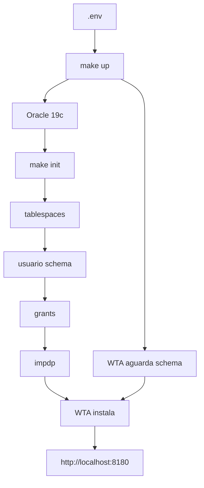

  
[https://nwerp.ai](https://nwerp.ai)

# WinthorDocker

Laboratorio local do Oracle 19c (Enterprise) e do Winthor Anywhere (WTA): sobe a instancia, cria tablespaces e o schema, concede privilegios, importa um dump via `impdp` e instala o WTA no primeiro start.

Este repositorio e um **projeto open source**: o laboratorio Docker, nao o produto Winthor nem o Oracle.

**Oracle**, **Winthor** e demais marcas citadas pertencem aos respectivos proprietarios. Este projeto nao e afiliado, endossado nem oficial da Oracle, da TOTVS ou da PC Sistemas.

Toda a configuracao fica no `.env`. Os scripts nao carregam senhas nem nomes de cliente hardcoded.

## Pre-requisitos

- Docker e Docker Compose v2
- Conta no [Oracle Container Registry](https://container-registry.oracle.com/) com aceite da imagem **database/enterprise**
- Host **x86_64**: tag `19.3.0.0` (`ORACLE_PLATFORM=linux/amd64`). A tag `19.19.0.0` e so ARM
- Login na registry:

```bash
docker login container-registry.oracle.com
```

- Tarball Data Pump em `DUMP_BACKUP` (descompactado em `dump/` por `make dump-extract` / `make init`)
- Saida a internet no container WTA (repositorios TOTVS na primeira instalacao)

A primeira inicializacao do Oracle 19c pode levar 15–30 minutos.

## Inicio rapido

```bash
cp .env.example .env
# ajuste senhas, SID, PDB e o nome do dump se necessario

make up
# aguarde o Oracle ficar healthy (make logs)

make init
# o WTA espera o schema e instala no primeiro start
# acesso: http://localhost:8180
```

Equivalente sem Make:

```bash
mkdir -p dump dados/oradata dados/wta
chown -R 54321:54321 dados/oradata dump
docker compose up -d
docker compose exec oracle-db /scripts/01-init-db.sh
```


## Conectar

Com os defaults do `.env.example`:

```text
Host:     localhost
Porta:    1521
Service:  WINT
Usuario:  WINTHOR
Senha:    valor de SCHEMA_PASSWORD
```

```bash
make sql
# ou
sqlplus WINTHOR/<senha>@//localhost:1521/WINT
```

SYS/SYSTEM usam `ORACLE_PWD` (usuario `system` ou `/ as sysdba` de dentro do container).

WTA (defaults): `http://localhost:8180` — mesmo usuario/senha do Winthor apos a configuracao inicial no browser.

## Estrutura

```text
.env.example          modelo de configuracao
docker-compose.yml    Oracle 19c + WTA
Makefile              up, down, logs, init, import, sql, wta-install
scripts/
  lib/common.sh       defaults, validacao, renderizacao de SQL
  01-init-db.sh       orquestrador (espera o banco + demais passos)
  02-*.sql.tpl        tablespaces (idempotente)
  03-*.sql.tpl        usuario do schema (idempotente)
  04-*.sql.tpl        grants e directory DUMP_DIR
  05-import-dump.sh   impdp com remap_schema
wta/                  imagem e instalador Linux (IzPack)
dump/                 coloque o .dmp aqui (nao versionado)
dados/oradata         datafiles persistentes (nao versionado)
dados/wta             instalacao WTA em /opt/pcsist/produtos (nao versionado)
assets/               WINTHOR-3400.zip + winthor-setup-1.9.0.zip (nao versionados)
docs/
  assets/nwerp.png    logo nwerp.ai
  configuracao.md     variaveis de ambiente
  operacao.md         dia a dia e troubleshooting
```


## Variaveis mais usadas


| Variavel                   | Default                     | Uso                              |
| -------------------------- | --------------------------- | -------------------------------- |
| `ORACLE_IMAGE`             | `.../enterprise:19.3.0.0`   | 19c amd64; `19.19.0.0` so em ARM |
| `ORACLE_PLATFORM`          | `linux/amd64`               | `platform:` do Compose           |
| `ORACLE_SID`               | `ORLCDV`                    | SID da instancia                 |
| `ORACLE_PDB`               | `WINT`                      | PDB / service name               |
| `ORACLE_PWD`               | (ver `.env.example`)        | senha SYS/SYSTEM                 |
| `SCHEMA_DESTINO`           | `WINTHOR`                   | schema criado no PDB             |
| `SCHEMA_PASSWORD`          | (ver `.env.example`)        | senha do schema                  |
| `SCHEMA_ORIGEM`            | `COAGRO`                    | schema dentro do dump            |
| `DUMP_BACKUP`              | `dados/backup_datapump_WINT_*.tar.gz` | tarball extraido por `make dump-extract` |
| `DUMP_FILE_NAME`           | `backup_datapump_WINT_..._%U.dmp` | arquivo(s) em `dump/` (`%U` = 01, 02) |
| `WTA_HTTP_PORT`            | `8180`                      | HTTP do WTA no host              |
| `WTA_LOJA` / `WTA_EMPRESA` | `1` / `1`                   | equivalentes ao login do Winthor |


Lista completa em [docs/configuracao.md](docs/configuracao.md). Operacao e problemas comuns em [docs/operacao.md](docs/operacao.md).

## Fluxo




O import **nao** roda sozinho no start do container: o dump pode nao existir e o `impdp` e demorado. Use `make init` (tudo) ou `make import` (so o dump).

O WTA **espera** o Oracle healthy e o schema (`make init`). Se o schema ainda nao existir, o instalador tenta de novo. A configuracao inicial no browser (wizard TOTVS) continua manual.

## Observacoes

- Nao commite o `.env`.
- `SID` e caminho dos datafiles precisam bater: `/opt/oracle/oradata/${ORACLE_SID}/${ORACLE_PDB}/`.
- `assets/WINTHOR-3400.zip` e o instalador do cliente Winthor; o Compose nao o monta.
- O instalador Linux fica em `assets/winthor-setup-1.9.0.zip` (nao versionado). `make up` baixa de novo se o arquivo faltar.
- O container WTA precisa de saida a internet na instalacao (`repo.pcinformatica.com.br`, `hub.pcinformatica.com.br`, `servicos.pcinformatica.com.br`).
- O Oracle deste lab ja usa SGA+PGA altos; o WTA pede ~8 GB livres no host.


## Marcas

**Oracle** e marcas relacionadas sao de propriedade da Oracle Corporation. **Winthor** e marcas relacionadas sao de propriedade dos respectivos proprietarios (TOTVS / PC Sistemas). Este laboratorio open source nao e um produto oficial e nao implica parceria, afiliacao ou endosso.